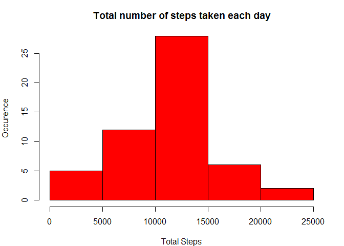
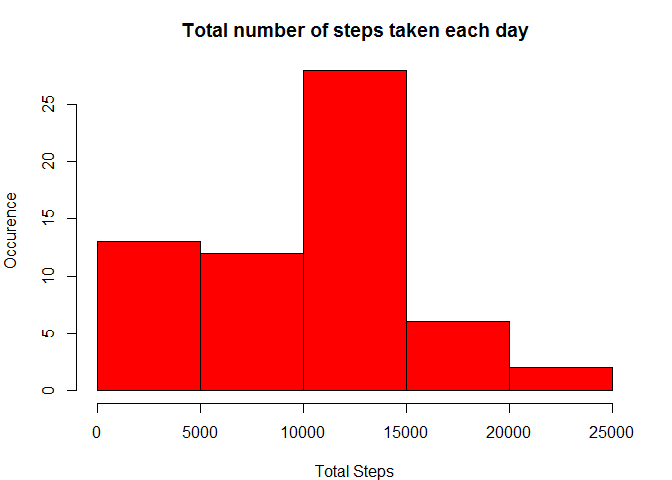
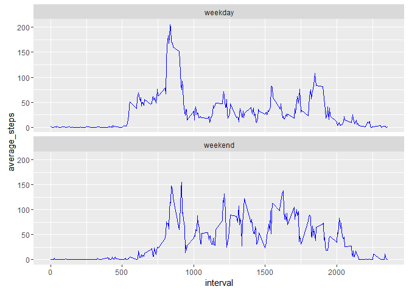

# Reproducible Research: Course Project 1
Hugo Tran  
February 8, 2016  

Set Global Options to turn echo = TRUE for all code chunks


```r
library(knitr)
opts_chunk$set(echo=TRUE)
```

#Loading and preprocessing the data
 1. Load data from csv data file into local variable ***rawData*** and then convert
 ***date*** column into Date format

```r
rawData <- read.csv("activity.csv")
rawData$date <- as.Date(rawData$date)
```

  
#What is mean total number of steps taken per day?

1. Summarized input table, calculate sum of step by day

```r
library(plyr)
stepsPerDay <- ddply(rawData,.(date),summarise, total_steps = sum(steps))
```

2. Plot the histogram of total steps taken per day

```r
par(mfrow=c(1,1)) #1 row, 1 column only
par(mar= c(4,4,3,2)) # set margin

hist(stepsPerDay$total_steps, 
     col = "red", 
     xlab = "Total Steps", 
     ylab = "Occurence",
     main = "Total number of steps taken each day")
```



3. Mean and median of the total number of steps taken per day

```r
c(mean=mean(stepsPerDay$total_steps, na.rm = TRUE),    median=median(stepsPerDay$total_steps, na.rm = TRUE))
```

```
##     mean   median 
## 10766.19 10765.00
```

#What is the average daily activity pattern?

 Summarize the average number of steps taken per interval, averaged across all days


```r
stepsPerInterval <- ddply(rawData,~interval,summarise, average_steps = mean(steps, na.rm = TRUE))
```

1. Make a time series plot (i.e. type = "l") of the 5-minute interval (x-axis) and the average number of steps taken, averaged across all days (y-axis)


```r
with(stepsPerInterval, plot(interval,average_steps,type = "l", xlab = "Interval",
                   ylab = "Average steps across all days",
                   main = "Average steps per interval across all days"))
```


2. Which 5-minute interval, on average across all the days in the dataset, contains the maximum number of steps?
        Find the interval that have max average steps across all days

```r
library(xtable)
maxInterval <- stepsPerInterval[stepsPerInterval$average_steps ==max(stepsPerInterval$average_steps),]
maxInterval
```

```
##     interval average_steps
## 104      835      206.1698
```

```r
xt <- xtable (maxInterval)
print(xt, type = "html")
```

```
## <!-- html table generated in R 3.2.3 by xtable 1.8-2 package -->
## <!-- Mon Feb 08 13:41:54 2016 -->
## <table border=1>
## <tr> <th>  </th> <th> interval </th> <th> average_steps </th>  </tr>
##   <tr> <td align="right"> 104 </td> <td align="right"> 835 </td> <td align="right"> 206.17 </td> </tr>
##    </table>
```


#Imputing missing values

1. The total number of missing values in the dataset (i.e. the total number of rows with NAs)

```r
MissingCount <- sum(is.na(rawData))
print(MissingCount)
```

```
## [1] 2304
```

2. Strategy for filling in all of the missing values in the dataset: filling with meadian of steps for that interval accross all days, stored into ***filledData*** table

3. Create a copy of the initial raw data frame, to be filled with non-missing values

```r
filledData <- rawData

# Create a summary table of median of step per interval across all days
medianPerInterval <- ddply(rawData,~interval,summarise, median_steps = median(steps, na.rm = TRUE))

# Use for loop to replace missing value of rawData with median values for the corresponding interval
for(i in 1:nrow(filledData)){
        if (is.na(filledData[i,"steps"]))
               filledData[i,"steps"] <- min(medianPerInterval[medianPerInterval$interval==filledData[i,"interval"],"median_steps"]) 
}
```

4. Make a histogram of the total number of steps taken each day and Calculate and report the mean and median total number of steps taken per day


```r
NewStepsPerDay <- ddply(filledData,.(date),summarise, total_steps = sum(steps))

# Plot new summary table
par(mfrow=c(1,1)) #1 row, 1 column only
par(mar= c(4,4,3,2)) # set margin

hist(NewStepsPerDay$total_steps, 
     col = "red", 
     xlab = "Total Steps", 
     ylab = "Occurence",
     main = "Total number of steps taken each day")
```



```r
# Calculate new mean & median
c(mean=mean(NewStepsPerDay$total_steps, na.rm = TRUE),    median=median(NewStepsPerDay$total_steps, na.rm = TRUE))
```

```
##      mean    median 
##  9503.869 10395.000
```

--> Filling non-empty value make the distribution of steps different: The total of steps each days will be smaller compared to non-removal case.

#Are there differences in activity patterns between weekdays and weekends?
1. Add weekdays column to the filled data set and 1 more column to determine weekend or not

```r
filledData$weekDays <- weekdays(filledData$date)
filledData = within(filledData, {
   day_Type = ifelse(weekDays == "Saturday"|weekDays == "Sunday","weekend","weekday")    
   })  
```

2. Make a panel plot containing a time series plot (i.e. type = "l") of the 5-minute interval (x-axis) and the average number of steps taken, averaged across all weekday days or weekend days (y-axis)


```r
# Summarize table 
NewStepsPerInterval <- ddply(filledData,.(day_Type,interval),summarise, average_steps = mean(steps, na.rm = TRUE))

# Plot panel
library(ggplot2)
ggplot(NewStepsPerInterval, aes(interval,average_steps))+geom_line(color="blue")+
    facet_wrap(~day_Type, nrow=2)
```



